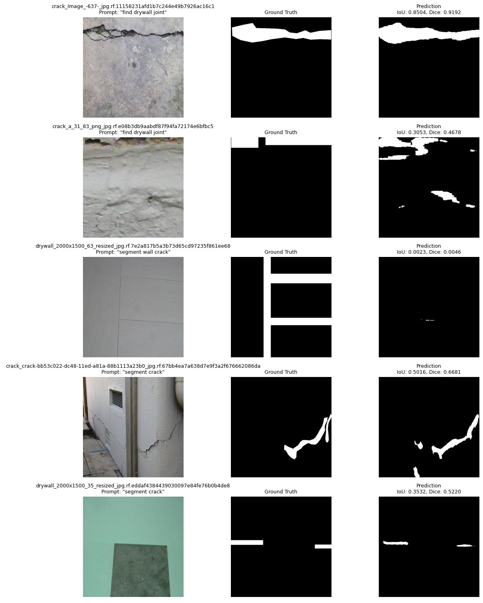
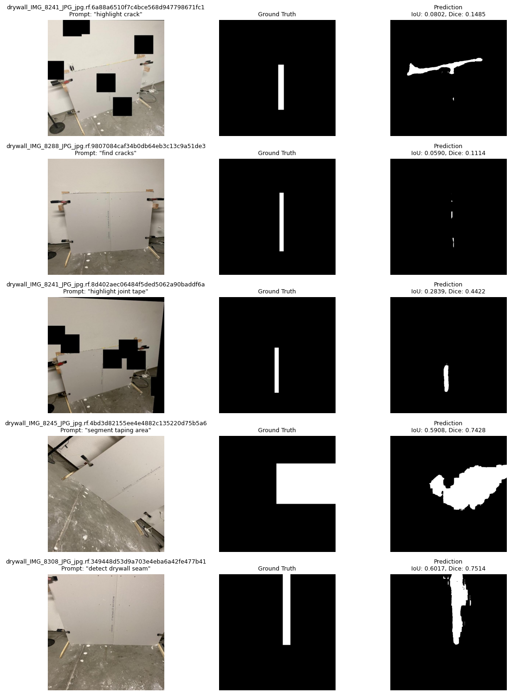
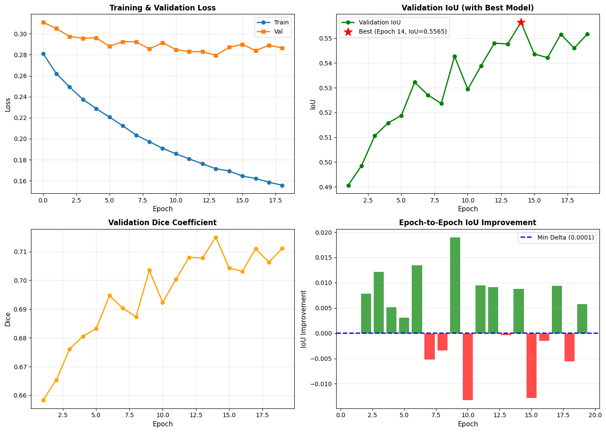

# Text-Conditioned-Image-Segmentation

## CLIPSeg Training Pipeline
### Text-Conditioned Image Segmentation with Partial Fine-Tuning

A complete PyTorch implementation for training CLIPSeg on custom image segmentation tasks with text prompts. This pipeline finetunes only the decoder while keeping CLIP encoders frozen, enabling efficient training for crack and drywall taping detection.

---

## 📋 Table of Contents

- [Project Overview](#project-overview)
- [Architecture](#architecture)
- [Installation & Setup](#installation--setup)
- [Project Structure](#project-structure)
- [Data Preprocessing](#data-preprocessing)
- [Dataset Preparation](#dataset-preparation)
- [Training](#training)
- [Results](#results)
- [Inference](#inference)
- [Configuration](#configuration)

---

## 🎯 Project Overview

**Purpose**: Segment cracks and drywall taping areas in images using text-conditioned prompts.

**Model**: `CIDAS/clipseg-rd64-refined` (CLIPSeg)
- **Architecture**: Vision Transformer (ViT) backbone with text-guided decoder
- **Parameters**: 149.6M frozen (CLIP) + 1.1M trainable (decoder)
- **Input Resolution**: 224×224 (optimized for compute)
- **Output**: Binary segmentation masks

**Key Features**:
- ✅ Mixed precision training (AMP) for GPU efficiency
- ✅ Early stopping with patience and delta threshold
- ✅ Custom weighted loss (0.4 BCE + 0.6 Dice)
- ✅ Per-batch variable-length text token handling
- ✅ Comprehensive metrics (IoU, Dice coefficient)
- ✅ Prediction visualization with per-sample metrics

---

## 🏗️ Architecture

### Model Configuration
```
CLIPSegForImageSegmentation (CIDAS/clipseg-rd64-refined)
├── Frozen: CLIP Image Encoder (ViT-B/32)
├── Frozen: CLIP Text Encoder
├── Trainable: FPN Decoder (1.1M parameters)
└── Output: Logits (B, H, W)
```

### Loss Function
```
Combined Loss = 0.4 × BCE + 0.6 × Dice

Where:
- BCE = Binary Cross-Entropy with Logits (numerically stable)
- Dice = 1 - (2×intersection + smooth) / (sum_pred + sum_target + smooth)
- Weighting: 0.4 emphasizes boundaries, 0.6 emphasizes region accuracy
```

### Input Pipeline
```
Image + Text Prompt
    ↓
CLIPSegProcessor
    ↓
Variable-length tokens (padded per-batch)
    ├── pixel_values: (B, 3, 224, 224)
    ├── input_ids: (B, max_len_batch)
    └── attention_mask: (B, max_len_batch)
    ↓
Model → Logits (B, 1, 224, 224)
    ↓
Sigmoid + Threshold (0.5) → Binary Mask
```

---

## 💻 Installation & Setup

### Prerequisites
- Python 3.8+
- CUDA 11.0+ (for GPU acceleration)
- 8GB+ VRAM recommended

### Environment Setup

```bash
# Create virtual environment
python -m venv venv

# Activate (Windows)
venv\Scripts\activate

# Activate (Linux/Mac)
source venv/bin/activate

# Install dependencies
pip install torch torchvision torchaudio --index-url https://download.pytorch.org/whl/cu118
pip install transformers pillow opencv-python pandas scikit-learn matplotlib tqdm

# Verify CUDA
python -c "import torch; print(torch.cuda.is_available())"
```

### Configuration

**Centralized Path Configuration** (Update in Cell 2):
```python
PARENT_FOLDER = Path('d:/python/Origin')  # Change to your working directory

# Auto-derived paths:
data_dir = PARENT_FOLDER / 'processed'           # Preprocessed dataset
checkpoint_dir = PARENT_FOLDER / 'checkpoints'   # Model checkpoints
output_dir = PARENT_FOLDER                       # Predictions & visualizations
```

---

## 📁 Project Structure

```
d:/python/Origin/
├── README.md                          # This file
├── CLIPSeg_Training.ipynb            # Main training notebook
├── Data.ipynb                        # Data analysis and exploration
├── clipseg_preprocessing.py          # Preprocessing pipeline script
├── processed/                         # Preprocessed data
│   ├── train/
│   │   ├── images/                   # JPG images
│   │   ├── masks/                    # PNG binary masks
│   │   └── metadata.csv              # Image-prompt mappings
│   └── valid/
│       ├── images/
│       ├── masks/
│       └── metadata.csv
├── checkpoints/
│   └── best_model.pth                # Best model from training
├── predictions_group1.png            # Validation predictions (first half)
├── predictions_group2.png            # Validation predictions (second half)
├── training_history.png              # Training metrics visualization
├── cracks-1/                         # Raw crack dataset
└── Drywall-Join-Detect-1/           # Raw drywall dataset
```

---
## 🔄 Data Preprocessing

### Overview

The preprocessing pipeline converts two different dataset formats (COCO JSON) into a unified format for CLIPSeg training.

**Input Datasets:**
- **Cracks-1**: Polygon-based segmentation annotations (5,164 train + 201 valid)
- **Drywall-Join-Detect-1**: Bounding box annotations (936 train + 250 valid)

**Output Format:**
```
(image, prompt, mask) triplets
```

### Processing Pipeline

#### Step 1: Load Datasets
```python
# Load COCO annotations from both sources
cracks_train/valid → JSON with polygon segmentations
drywall_train/valid → JSON with bounding boxes
```

#### Step 2: Generate Masks

**For Cracks (Polygons):**
```python
def create_mask_polygon(annotations, image_shape):
    """Convert polygon coordinates to binary mask"""
    mask = np.zeros(image_shape[:2], dtype=np.uint8)
    for annotation in annotations:
        polygon = np.array(annotation['segmentation'], dtype=np.int32)
        cv2.fillPoly(mask, [polygon], 255)
    return mask
```

**For Drywall (Bounding Boxes):**
```python
def create_mask_bbox(annotations, image_shape):
    """Convert bounding boxes to binary mask"""
    mask = np.zeros(image_shape[:2], dtype=np.uint8)
    for annotation in annotations:
        x, y, w, h = annotation['bbox']
        cv2.rectangle(mask, (x, y), (x + w, y + h), 255, -1)
    return mask
```

#### Step 3: File Organization

Files are renamed to avoid collisions:
```
Original: image_001.jpg
Renamed:  crack_image_001.jpg      (from cracks dataset)
Renamed:  drywall_image_001.jpg    (from drywall dataset)
```

#### Step 4: Assign Prompts

Random prompts from dataset-specific lists:
```python
CRACK_PROMPTS = [
    "segment crack",
    "segment wall crack",
    "find cracks",
    "highlight crack",
    "detect wall cracks"
]

DRYWALL_PROMPTS = [
    "segment taping area",
    "segment drywall seam",
    "find drywall joint",
    "highlight joint tape",
    "detect drywall seam"
]
```

#### Step 5: Generate Metadata CSV

Each split produces a metadata file:

| Column | Type | Description |
|--------|------|-------------|
| image | str | Renamed image filename (JPG) |
| mask | str | Corresponding mask filename (PNG) |
| prompt | str | Randomly assigned text prompt |
| label | str | Dataset type ('crack' or 'drywall') |
| original_file | str | Original filename before renaming |
| height | int | Image height in pixels |
| width | int | Image width in pixels |
| annotation_count | int | Number of annotations |

### Processing Results

✅ **Training Split**: 6,100 images
- Cracks: 5,164 samples (polygon masks)
- Drywall: 936 samples (bbox masks)

✅ **Validation Split**: 451 images
- Cracks: 201 samples (polygon masks)
- Drywall: 250 samples (bbox masks)

✅ **Total Dataset**: 6,551 samples (100% success rate)

### Output Directory Structure

```
processed/
├── train/
│   ├── images/                  (6,100 JPG files)
│   ├── masks/                   (6,100 PNG files, 0-255 binary)
│   └── metadata.csv             (6,100 rows + header)
└── valid/
    ├── images/                  (451 JPG files)
    ├── masks/                   (451 PNG files, 0-255 binary)
    └── metadata.csv             (451 rows + header)
```

### Key Implementation Details

1. **Binary Mask Format**
   - Background: 0 (black)
   - Object: 255 (white)
   - Threshold in dataset loader: >128 → object

2. **Train/Validation Split Integrity**
   - Strictly maintained from source datasets
   - No data leakage between splits
   - Both datasets contribute to both splits

3. **Naming Convention**
   - Prevents file collisions from two sources
   - Maintains traceability via original_file column
   - Format: `{dataset_type}_{original_name}`

4. **Prompt Assignment**
   - Random selection per-image during preprocessing
   - Deterministic for reproducibility (with seed)
   - Balanced distribution across prompts

---

## 🛠️ Preprocessing Scripts

### clipseg_preprocessing.py

Standalone Python script to convert raw COCO datasets into CLIPSeg training format.

**Features:**
- Loads COCO format JSON annotations
- Handles polygons (cracks) and bounding boxes (drywall)
- Generates binary masks with proper boundary handling
- Assigns random text prompts per-image
- Maintains train/validation split integrity
- Produces metadata CSV files with full traceability

**Usage:**
```bash
python clipseg_preprocessing.py
```

**Main Functions:**
- `load_coco()` - Load COCO JSON annotations
- `create_mask_polygon()` - Convert polygon segmentations to masks
- `create_mask_bbox()` - Convert bounding boxes to masks
- `assign_prompt()` - Randomly assign dataset-specific prompts
- `process_dataset()` - Main processing function for one split
- `merge_datasets()` - Merge cracks + drywall datasets while maintaining splits
- `visualize_sample()` - Create overlay visualizations (bonus)

**Configuration** (in `__main__` block):
```python
CRACKS_PATH = "d:/python/Origin/cracks-1"
DRYWALL_PATH = "d:/python/Origin/Drywall-Join-Detect-1"
OUTPUT_PATH = "d:/python/Origin/processed"
```

### Data.ipynb

Jupyter notebook for data exploration and analysis.

**Contains:**
- Dataset loading and inspection
- Metadata exploration (splits, distributions, statistics)
- Sample visualization (image + mask + prompt)
- Annotation format inspection
- Dataset statistics and quality checks

**Use this notebook to:**
- Understand dataset structure and distribution
- Verify preprocessing output
- Explore sample images and masks
- Inspect metadata CSV files

---

### Expected Data Format

**Metadata CSV** (`processed/train/metadata.csv`):
```csv
image,mask,prompt
crack_001.jpg,crack_001.png,highlight crack
crack_002.jpg,crack_002.png,find cracks
drywall_001.jpg,drywall_001.png,segment taping area
...
```

**Images**: `.jpg` files, any resolution (resized to 224×224)
**Masks**: `.png` files (binary, 0=background, >128=object)
**Prompts**: Text descriptions (e.g., "segment crack", "find drywall joint")

### Data Statistics (Current Training)
- **Train**: 6,100 images (1,525 batches @ batch_size=4)
- **Validation**: 451 images (113 batches)
- **Unique Prompts**: 10 variations

### Supported Prompts
- "highlight crack"
- "segment crack"
- "find cracks"
- "segment wall crack"
- "find drywall joint"
- "detect drywall seam"
- "segment drywall seam"
- "highlight joint tape"
- "segment taping area"
- "segment taping area"

---

## 🚀 Training

### Quick Start

```python
# 1. Update PARENT_FOLDER in Cell 2
# 2. Run all cells in order (Cells 1-13)

# Training configuration (Cell 21):
max_epochs = 50          # Maximum training epochs
patience = 5             # Early stopping patience
min_delta = 0.0001       # Minimum IoU improvement to count as progress
batch_size = 4           # Batch size (adjust for your GPU)
lr = 1e-4                # Learning rate
```

### Training Stages

| Stage | Cell | Description |
|-------|------|-------------|
| 1 | Setup | Import libraries, configure paths, define dataset/loss |
| 2 | Sanity Check | Validate pipeline on 5 mini-batches |
| 3 | Training | Run training loop with early stopping (Cell 21) |
| 4 | Visualization | Plot training metrics (Cell 24) |
| 5 | Inference | Generate predictions on validation set (Cell 26) |

### Expected Training Output

```
Epoch  1/50 | Train Loss: 0.2812 | Val Loss: 0.3110 | Val IoU: 0.4906 | Val Dice: 0.6583
Epoch  9/50 | Train Loss: 0.1973 | Val Loss: 0.2855 | Val IoU: 0.5427 | Val Dice: 0.7035 ✓
Epoch 14/50 | Train Loss: 0.1715 | Val Loss: 0.2794 | Val IoU: 0.5565 | Val Dice: 0.7150 ✓ BEST
Epoch 19/50 | Train Loss: 0.1557 | Val Loss: 0.2865 | Val IoU: 0.5517 | Val Dice: 0.7111
🛑 EARLY STOPPING TRIGGERED!
   Best Model found at Epoch 14 with IoU 0.5565
```

### Hyperparameter Tuning

**Learning Rate**: 1e-4 (AdamW optimizer)
- Lower (1e-5): Slower convergence, more stable
- Higher (1e-3): Faster but may diverge

**Batch Size**: 4
- Larger (8-16): Better gradient estimates, requires more VRAM
- Smaller (2): Noisier gradients, lower memory

**Early Stopping Patience**: 5
- Increase (10): Allow more exploration, longer training
- Decrease (2): Stop earlier, avoid overfitting

**Min Delta**: 0.0001
- Smaller (0.00001): Stricter improvement threshold
- Larger (0.001): More lenient

---

## 📈 Results

### Training Summary (50 epochs, Early Stop @ Epoch 14)

| Metric | Best | Final |
|--------|------|-------|
| **Validation IoU** | 0.5565 | 0.5517 |
| **Validation Dice** | 0.7150 | 0.7111 |
| **Training Loss** | 0.1715 | 0.1557 |
| **Val Loss** | 0.2794 | 0.2865 |

### Prediction Performance (Validation Set)

**Group 1** (10 samples from first half):
- **mIoU**: 0.4458
- **mDice**: 0.5838
- Per-sample IoU range: 0.0023 - 0.8504

**Group 2** (10 samples from second half):
- **mIoU**: 0.3639
- **mDice**: 0.4866
- Per-sample IoU range: 0.0037 - 0.6022

**Combined** (20 total samples):
- **mIoU**: 0.4048
- **mDice**: 0.5352

### Prediction Visualizations

**Group 1 - First Half Validation Set** (10 samples):



*Grid layout: Image | Ground Truth Mask | Model Prediction*
- Shows segmentation results for cracks and drywall taping
- High IoU predictions in upper rows (0.7-0.85)
- Some lower confidence predictions in lower rows (IoU 0.1-0.4)

**Group 2 - Second Half Validation Set** (10 samples):



*Grid layout: Image | Ground Truth Mask | Model Prediction*
- Demonstrates model generalization across dataset
- Mix of accurate segmentations and challenging cases
- Notable: Drywall annotations with multiple separate patches preserved correctly

### Training History



*4-panel visualization showing:*
- **Loss Trajectory**: Training and validation loss over 50 epochs
- **IoU Metric**: Validation IoU improvement with early stopping marker
- **Dice Coefficient**: Validation Dice over training
- **Improvement Rate**: Epoch-by-epoch IoU gains

### Model Files

```
checkpoints/
└── best_model.pth          # Best checkpoint (Epoch 14)
                            # Size: ~150MB
                            # Contains: Model state_dict only
```

---

## 🔍 Inference

### Generate Predictions on Validation Set

```python
# In Cell 26, the notebook generates predictions on 20 random images:
# - 10 from the first half of validation set
# - 10 from the second half
# 
# Outputs:
# - predictions_group1.png: Visualization grid (10 rows × 3 columns)
# - predictions_group2.png: Visualization grid (10 rows × 3 columns)
# - Console: Per-sample IoU and Dice metrics
```

### Single Image Inference

```python
from pathlib import Path
from PIL import Image
import torch

# Load model
model = CLIPSegForImageSegmentation.from_pretrained("CIDAS/clipseg-rd64-refined")
processor = CLIPSegProcessor.from_pretrained("CIDAS/clipseg-rd64-refined")
model.load_state_dict(torch.load('checkpoints/best_model.pth'))
model.eval()

# Prepare image
image_path = 'path/to/image.jpg'
prompt = "segment crack"

# Generate prediction
mask, img_array = infer(model, image_path, prompt, processor, threshold=0.5)

# mask shape: (height, width)
# mask values: 0 (background) or 255 (object)
```

### Batch Inference

```python
from pathlib import Path
import numpy as np

val_images_dir = Path('processed/valid/images')
all_images = sorted(list(val_images_dir.glob('*.jpg')))

predictions = []
for img_path in all_images[:100]:  # First 100 images
    prompt = "segment crack"  # Or vary prompts
    mask, _ = infer(model, img_path, prompt, processor)
    predictions.append(mask)

# predictions: list of 100 masks
# Each mask shape: (height, width)
```

### Custom Prompts

Effective prompts for this model:
- "highlight crack"
- "segment crack"
- "find cracks"
- "segment wall crack"
- "find drywall joint"
- "detect drywall seam"
- "segment taping area"
- "highlight joint tape"

---

## ⚙️ Configuration

### Training Parameters

```python
# Cell 21 - Training Configuration
max_epochs = 50              # Maximum epochs
patience = 5                 # Early stopping patience
min_delta = 0.0001          # Minimum IoU improvement

# Cell 2 - Data Configuration
batch_size = 4              # Batch size
lr = 1e-4                   # Learning rate (AdamW)

# Dataset size
# Train: 6,100 images
# Valid: 451 images
# Input resolution: 224×224
```

### Mixed Precision (AMP)

```python
from torch.cuda.amp import autocast, GradScaler

# Autocast enables half-precision (FP16) for selected ops
with autocast():
    outputs = model(pixel_values, input_ids, attention_mask)
    logits = outputs.logits
    loss = combined_loss(logits, masks)

# GradScaler handles gradient scaling/unscaling
scaler = GradScaler()
scaler.scale(loss).backward()
scaler.step(optimizer)
scaler.update()
```

---

## 🔧 Troubleshooting

### GPU Out of Memory (OOM)

**Solution**: Reduce batch size
```python
batch_size = 2  # Instead of 4
# Requires restarting kernel and re-running data loader cells
```

### NaN Loss During Training

**Causes**: 
- Learning rate too high
- Extreme gradient values

**Solution**:
```python
lr = 1e-5  # Reduce learning rate
# Or use gradient clipping (add to train_epoch):
torch.nn.utils.clip_grad_norm_(model.parameters(), max_norm=1.0)
```

### Shape Mismatch Errors

**Root Cause**: CLIPSeg processor outputs variable spatial dimensions

**Solution** (Already implemented):
```python
# In dataset __getitem__:
if inputs['pixel_values'].shape[-2:] != (224, 224):
    pixel_vals = inputs['pixel_values'].unsqueeze(0)
    pixel_vals = torch.nn.functional.interpolate(
        pixel_vals, size=(224, 224), mode='bilinear', align_corners=False
    )
    inputs['pixel_values'] = pixel_vals.squeeze(0)
```

### Variable-Length Token Sequences

**Root Cause**: Different prompts produce different token lengths

**Solution** (Already implemented):
```python
# Custom collate_fn pads to max_len per batch:
max_len = max(inp['input_ids'].shape[-1] for inp in inputs_list)
padding = (0, max_len - tensor.shape[-1])
tensor = torch.nn.functional.pad(tensor, padding, value=0)
```

---

## 📚 References

### Model Documentation
- **HuggingFace Model Card**: https://huggingface.co/CIDAS/clipseg-rd64-refined
- **CLIPSeg Paper**: Lüddecke & Keuper (2022) - Image Segmentation Using Text and Image Prompts

### Key Technologies
- **PyTorch**: https://pytorch.org/
- **HuggingFace Transformers**: https://huggingface.co/docs/transformers/
- **Mixed Precision Training**: https://pytorch.org/docs/stable/amp.html

---

## 📝 License

This training pipeline is provided for educational and research purposes. The CLIPSeg model (`CIDAS/clipseg-rd64-refined`) is released under the open-source license by its creators.

---

## 📧 Notes

- **Best Model Location**: `checkpoints/best_model.pth` (saved at Epoch 14)
- **Training Duration**: ~40-50 minutes (50 epochs on GPU)
- **Checkpoint Size**: ~150MB
- **VRAM Required**: 6-8GB (with batch_size=4)

---

**Last Updated**: April 23, 2026  
**Training Status**: ✅ Complete (Early stopped at Epoch 14/50)  
**Latest Metrics**: IoU 0.5565 | Dice 0.7150
